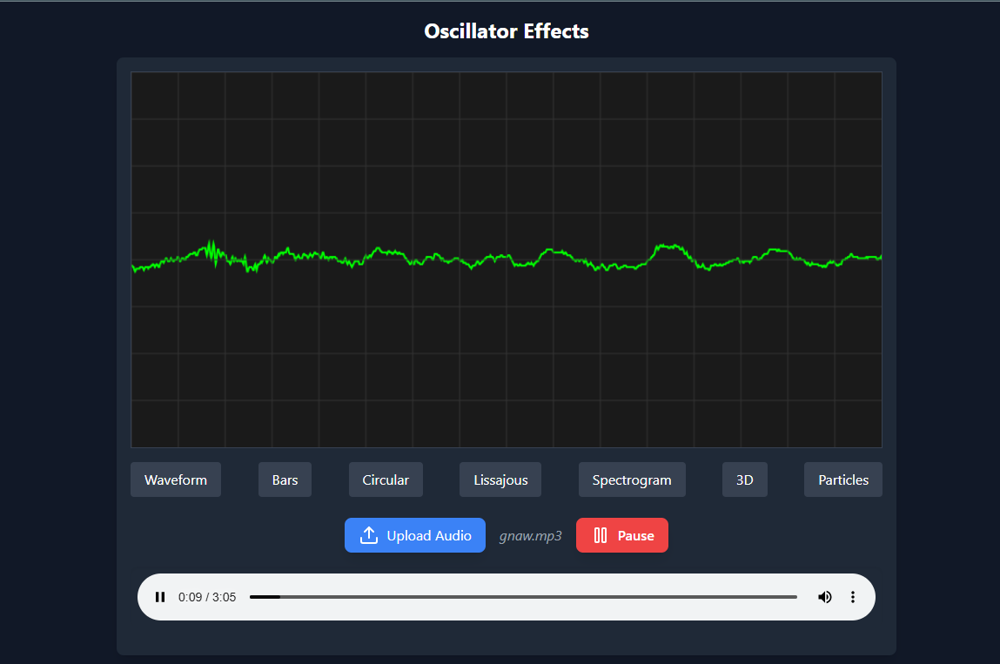

# Oscillator with Effects

A simple and customizable web-based audio visualizer that allows you to upload an audio file, play/pause the audio, and switch between different visualizations such as waveform, bars, circular, spectrogram, and more.

## Features
- Upload an audio file
- Play/Pause the audio
- Switch between multiple visualization effects
- Real-time audio rendering
- Interactive canvas for audio visualization

## Installation

# Clone the repository
```bash
git clone https://github.com/your-username/editor-oscillator.git
```
# Navigate to the project directory
```bash
cd oscillator-visualizer
```
# Install dependencies
```bash
npm install
```
# Start the development server
```bash
npm run start
```
## Usage

1. Run the application using npm start.
2. Upload an audio file by clicking the 'Upload Audio' button.
3. Play or pause the audio using the play/pause button.
4. Switch between different visualization effects using the buttons provided.

## Visualizations

- Waveform
- Bars
- Circular
- Lissajous
- Spectrogram
- 3D
- Particles

## Technologies Used

- React
- TypeScript
- Tailwind CSS
- HTML5 Canvas API
- Web Audio API

## Screenshot


